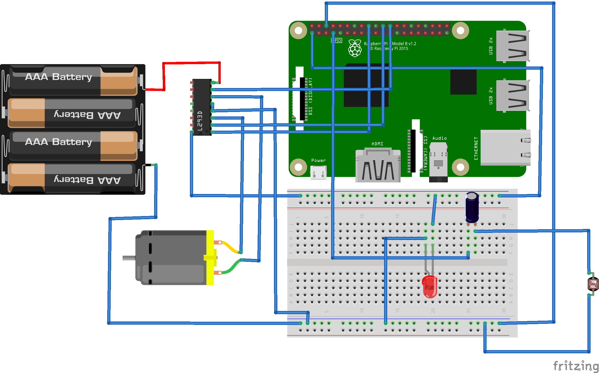

# PetFeedr :dog:


[](https://github.com/RyanDsilva/petfeeder/stargazers)

<p align="center">
  <a href="https://petfeedr.netlify.com/" rel="noopener" target="_blank">
 </a>
</p>

---

> Automated Remote Pet Feeder, becuase pets are generally better than humans :smirk:

---

## Features

<p align="justify">
  Pets need special treatment and special care. Due to nowadays busy life style, this task is not as simple as it used to be. Most people that have pets know the struggle that comes with it. The goal of this project is to introduce, design and implement a smart pet system. To address this issue, ‘PetFeedr’ is an IOT-enabled, remote-controlled pet feeder that can feed your pet in your absence. PetFeedr is powered by a Raspberry Pi 3 at its core and is controlled by a web application that triggers the ‘feed’ action. The PetFeedr works over a Wi-Fi connection and hence can be controlled from anywhere in world with an active internet connection.
</p>

## Circuit Diagram

### Components:

- Raspberry Pi 3 B+
- L293D Motor Controller
- LDR and Laser
- 1uF capacitor
- 4x AA battery pack
- DC Motor
- Jumper cables

<div align="center">
  
</div>

---

## Installation & Setup

1. Clone this repository on your Raspberry Pi.
2. Make the connections as per the circuit diagram.
3. Change the keys in the code to match your specific keys.

```sh
$ python3 petfeedr.py
```

---

## Contributors

- [@RyanDsilva](https://github.com/RyanDsilva)
